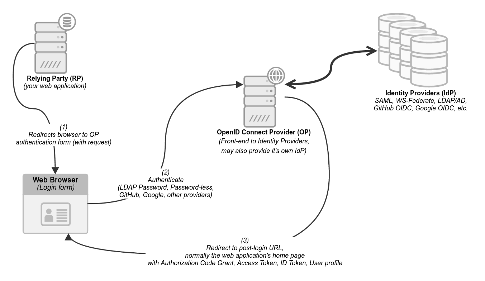

# grafana-keycloak
This repo contains enablement material for SSO setup between Grafana and Keycloak.

 

## Summary

This project helps you quickly set up Grafana and Keycloak (no licensing required), and then easily provision them so that you can have your own complete SSO-enabled environment. You can then use this as a testbed and learning space. For example: you can try things like intentionally breaking your configuration, and seeing the results in Grafana or Keycloak application logs right away.

With Grafana running on your own machine, and Keycloak running on EC2, your networking will be very simple to manage. However, you can also use this project with Grafana running in Grafana Cloud. This documentation will first have you run Grafana on your own machine, and then show you the steps required to switch to Grafana Cloud, while still using your EC2-based Keycloak instance as the OpenID Connect provider.

Wherever possible, automation solutions will be used, for example Docker Compose and Terraform.

 

## OpenID Connect

This image is stolen from Mozilla's very excellent [OIDC In A Nutshell](https://infosec.mozilla.org/guidelines/iam/openid_connect.html#oidc-in-a-nutshell) page.

If you are not yet familiar with OpenID Connect, I highly recommend you spend a bit of time there to get started.

For this project: 
- Grafana will be in the role of "RP" - the party that relies on some other entity to manage authentication, and provide authorization information about the authenticated user.
- Keycloak will be in the combined role of "OP" (OpenID Connect Provider), and "IDP" (Identity Provider).

So Keycloak will not only provide the database of users whom we want logging in to Grafana, it will also function as the OpenID Connect Provider, creating/providing such things as tokens (access tokens, retry tokens, etc.), and an API where Grafana can use these tokens in various ways.

 

## A few more notes:

### Simple network setup

By putting Grafana on your own machine, and Keycloak on EC2, your networking can be very simple for OIDC: both the browser and Grafana can use the remote EC2 address for their respective roles (browser redirection, API calls), without you needing to manage a more complex networking setup. (You are more than welcome to try other ways of doing this if you are comfortable with the networking requirements.)

### Secure communications

Keycloak will run with a self-signed certificate; easy setup instructions for this are provided, and are in fact [directly based on Keycloak's online documentation](https://www.keycloak.org/server/containers#_writing_your_optimized_keycloak_containerfile). OBVIOUSLY this is not a recommended solution for production environments.

In addition, these instructions will include guidance to help you be sure that your EC2 Keycloak instance is only accessible from the IP addresses you select (your office or home, Grafana Cloud, etc.)

 

# Setting up the project

[Keycloak setup on EC2](./documentation/keycloak-EC2-setup.md)

[Grafana setup on your machine](./documentation/grafana-local-machine-setup.md)

[Create a realm, a user, and a client in Keycloak](./documentation/keycloak-initial-configuration.md)

[Configure Generic OAuth in Grafana](./documentation/grafana-configuration.md)

[General testing](./documentation/general-testing.md)

[Try breaking some things](./documentation/try-breaking-some-things.md)

[Try switching to Grafana Cloud](./documentation/switch-to-grafana-cloud.md)

     

# State of this project:

This is a first draft of these notes and therefore will be somewhat terse, assuming you know are bringing some prerequisite knowledge. Later versions of this may expand to add more enablement content on the prerequisites but no promises are made as of now.
