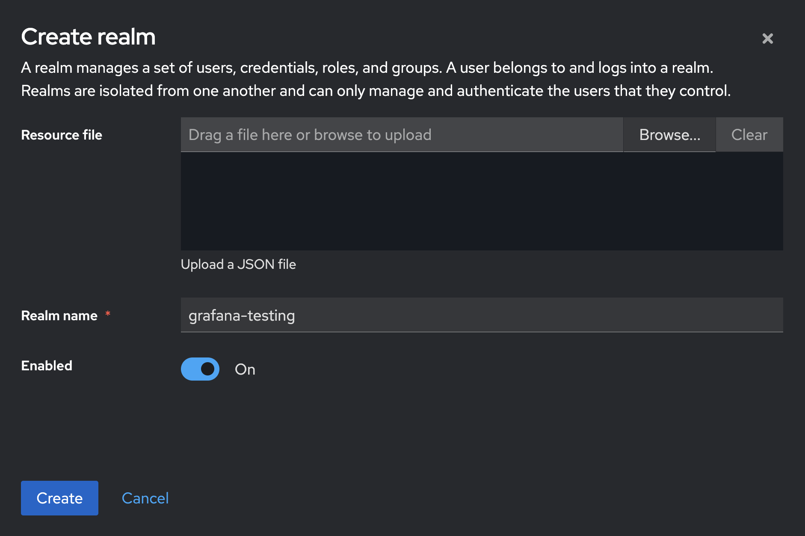
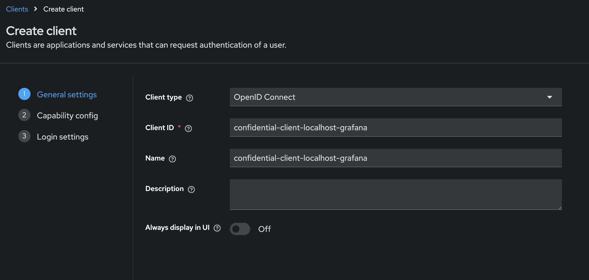
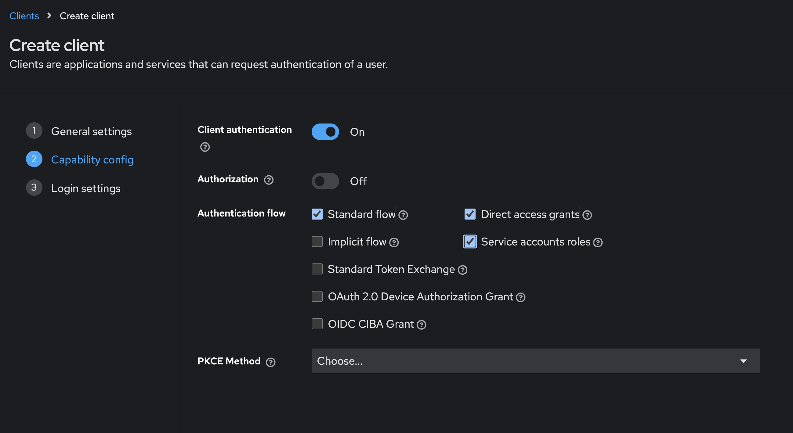
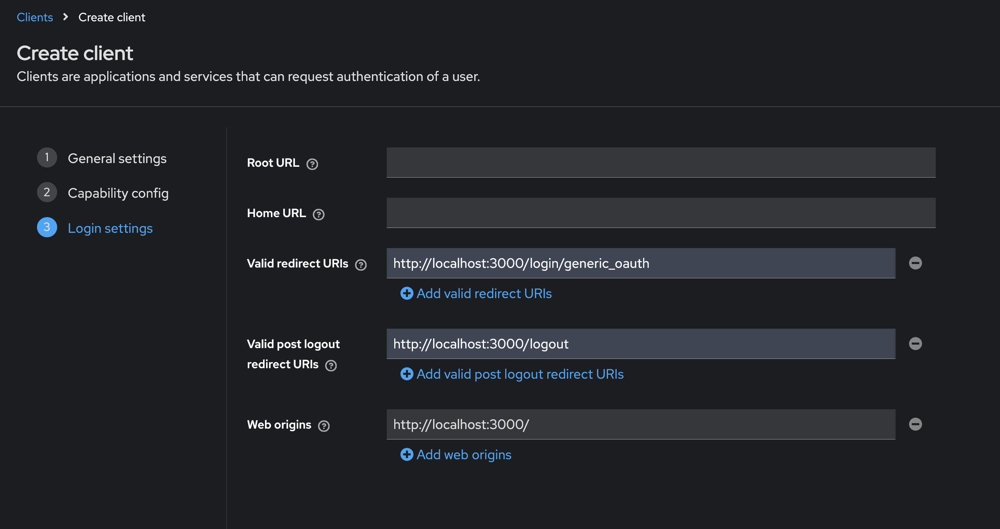

# Keycloak initial configuration

If you watched [the video mentioned earlier](https://www.youtube.com/watch?v=fvxQ8bW0vO8), these steps should be familiar. Either way, they're easy.


<br><br>
## Create a realm

We don't want to be working in the master realm; using the Keycloak UI, create a new realm and call it ```grafana-testing```:

<br>



After the realm is created, it should appear as your "Current Realm".


<br><br>
## Create a user

Using the Users link in the left nav, go to the users list for the current realm, and then use click the ```Add user``` button.

You only need to provide values for the 4 fields under General. For the email address: don't use an email address that is already part of a Hosted Grafana instance (such as your Grafana Labs email if you are a GL employee.) This can lead to problems when you switch to using HG with Keycloak.

You don't actually need a registered email address for this step; you could just use something like 

```your.name@test.com``` (feel free to fill in your actual name.)

The only requirement for now it that it is formatted as a valid email address, and that it's unique within the Keycloak realm you're currently using.

> This project doesn't get into the topic of using real/verified email addresses, but it's an area you can look further into in [the Keycloak documentation](https://www.keycloak.org/docs/latest/server_admin/index.html#assembly-managing-users_server_administration_guide).


<br><br>
## Create a client (manual method)

Before doing this through a quick provisioning process, it can be good to see how to create clients manually. We'll use some quick screenshots you can follow for this process; once agInain, watching [the video mentioned earlier](https://www.youtube.com/watch?v=fvxQ8bW0vO8) can be a helpful guide here. In this case, we are creating a "confidential client", which is the second example in that video of creating a client.

<br>

### General settings

In the "General settings" form, you can provide ```confidential-client-localhost-grafana``` as both the ID and the name of the client.




<br>

### Capability config

In "Capability config, enable "Client authentication", "Direct access grants", and "Service accounts roles"




<br>

### Login settings

In "Login settings", provide the values as shown here:




<br>

Those values are:

```http://localhost:3000/login/generic_oauth```

```http://localhost:3000/logout```

```http://localhost:3000/```


<br><br>
## Create a client (upload method)

