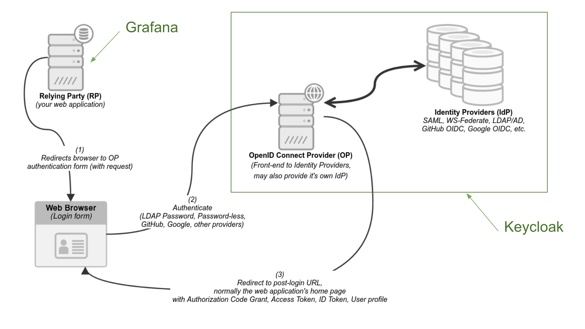

# Testing Grafana Generic OAuth with Keycloak

<br>

## Quick review

In our test, your browser will switch (redirect) between 2 hosts: Grafana on your local machine, and Keycloak on your EC2 host. In our test setup, Keycloak plays the roles of both the OpenIDConnect Provider (OP) and the Identity Provider (IDP).

(See [the Keycloak documentation for discussion on using a federated/brokereed IDP](https://www.keycloak.org/docs/latest/server_admin/index.html#_identity_broker), as opposed to Keycloak functioning as its own IDP.)

Grafana relies on Keycloak for authentication, so in our envirionment, Grafana is the Relying Party, or RP.




<br>

## Browser setup

I recommend having 2 browsers open while you test. In the browser you've been using, it's handy to keep Grafana and Keycloak logged in, since you are acting as an administrator of both of those services.

Using an incognito browser, you can also simultaneously play the role of an end user who wants to log into Grafana, and exists in the Keycloak IDP database. So create a new incognito browser window and in it, open up [Grafana on your local machine](http://localhost:3000). You should have a new session with Grafana in this browser, so you should be seeing the login screen, including the option to log in with Keycloak.

Click that login button. Your browser is redirected to Keycloak on the EC2 instance. There, you can log in as the user you created in the ```grafana-testing``` realm.

When that login is successful at Keycloak, your browser should be redirected back to Grafana, and you should be logged in. If anything didn't work, the section below on viewing application logs can be helpful for debugging.

<br>

## See your actual session on Keycloak
Keycloak is your OP; you are now logged in there, and also that login has been "federated to" (shared with) Grafana. You can actually go to Keycloak itself:

- from the primary, non-incognito browser window (where you are configuring Keycloak as an Admin), copy the Keycloak URL, excluding the path. So everything starting from ```https://```, up to and including ```:8443```;

- in a new tab in your incognito browswer window, paste what you just copied into the URL bar, and then append: 
```/realms/grafana-testing/account```.

This URL should take you to the "Personal" page in Keycloak, which is one of the few areas of Keycloak that your end user should be able to see; i.e. they don't get the full Admin experience you've been using up to now.

Having this page open in a separate incognito tab gives you the option of logging your end user out of Keycloak, so that you can try also logging that user out of Grafana, and trying the complete login process again. Your Admin sessions in your primary browser window should not be affected.

<br>

## Looking at application logs on both ends

Since you are running both of these services yourself, you have access to all of the application logs on both ends. Whether you're using Docker Desktop or another means of running Grafana as a container, you should be able to easily see your logs. When problems happen with OIDC, this is one of the first places to go: Grafana will try to tell you whatever it can in its logs about what happened during the OIDC flow.

<br>

## Try breaking some things

In fact, it can be interesting to intentionally cause problems, like misconfigurations, or network connectivity problems, and see what Grafana has to say about it. You can also look at the Keycloak logs on the EC2 instance; since it's running in Docker there as well, you should be able to tail the logs there as well. For example, you could run ```docker logs keycloak -f``` and you should at that point be seeing a tail of the Keycloak logs.

<br>

## OIDC Flow

It's good to get to know [the OpenID Connect flow](https://infosec.mozilla.org/guidelines/iam/openid_connect.html#detailed-oidc-authentication-flow) as you dive into OIDC. The steps outlined in that flow show what just happened, assuming you successfully logged in and are now seeing the Grafana home UI. Knowing this flow might also be helpful in debugging OIDC setups down the road.


<br><br>

## Next steps

The last step of this documentation is to [try setting up a Cloud Grafana instance with your Keycloak instance](../documentation/switch-to-grafana-cloud.md).


